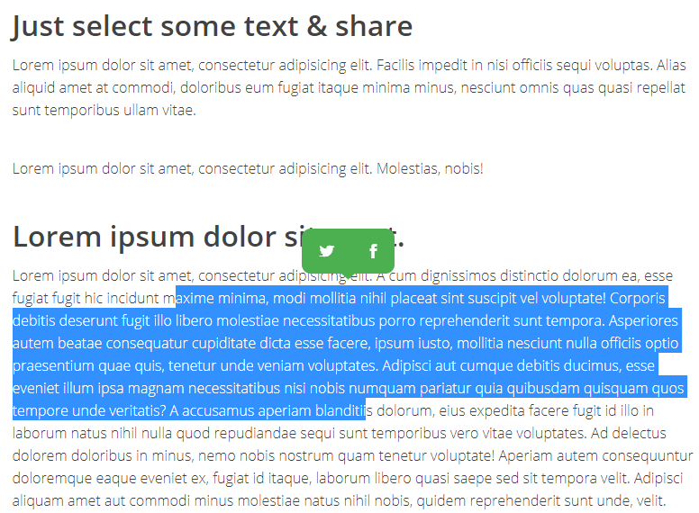

# ShareSelected.js
*Share selected text on Twitter and some others social networks. Based on [Vincent Loy](http://vincent-loy.fr) [ShareSelectedText.js](https://github.com/VincentLoy/share-selected-text)*



This is a little bit redesigned version of [ShareSelectedText.js](https://github.com/VincentLoy/share-selected-text)


ShareSelected.js works like [ShareSelectedText.js](https://github.com/VincentLoy/share-selected-text) and currently support the following social medias & services:
- Twitter
- Buffer
- Reddit
- Stumbleupon
- tumblr
- Digg
- Linkedin
- Facebook

## Getting started

Add the CSS file (also you have to copy the `fonts` directory and the `shareSelected.css` file in the same directory)
```html
<link rel="stylesheet" href="css/shareSelected.css"/>
```

Add the Javascript file before `body` HTML closing tag.
```html
<script src="js/shareSelected.js"></script>
```

Then, you can init the plugin :
```javascript
// plugin initialization with default options
shareSelected('.my-super-selector', {
    tooltipClass: '',    // cool, if you want to customize the tooltip
    sanitize: true,      // will sanitize the user selection to respect the Twitter Max length (recommended) 
    buttons: [           // services that you want to enable you can add : 
        'twitter',       // - twitter, tumblr, buffer, stumbleupon, digg, reddit, linkedin, facebook
        'buffer'
    ],
    anchorsClass: '',    // class given to each tooltip's links
    twitterUsername: '', // for twitter widget, will add 'via @twitterUsername' at the end of the tweet.
    facebookAppID: '', // Can also be an HTML element inside the <head> tag of your page : <meta property="fb:APP_ID" content="YOUR_APP_ID"/>
    facebookDisplayMode: 'popup', //can be 'popup' || 'page'
    tooltipTimeout: 250  //Timeout before that the tooltip appear in ms
});
```

## Changelog
- v1
    - initial release